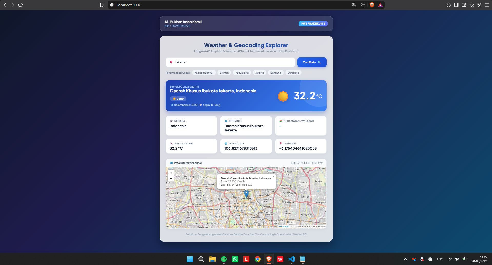
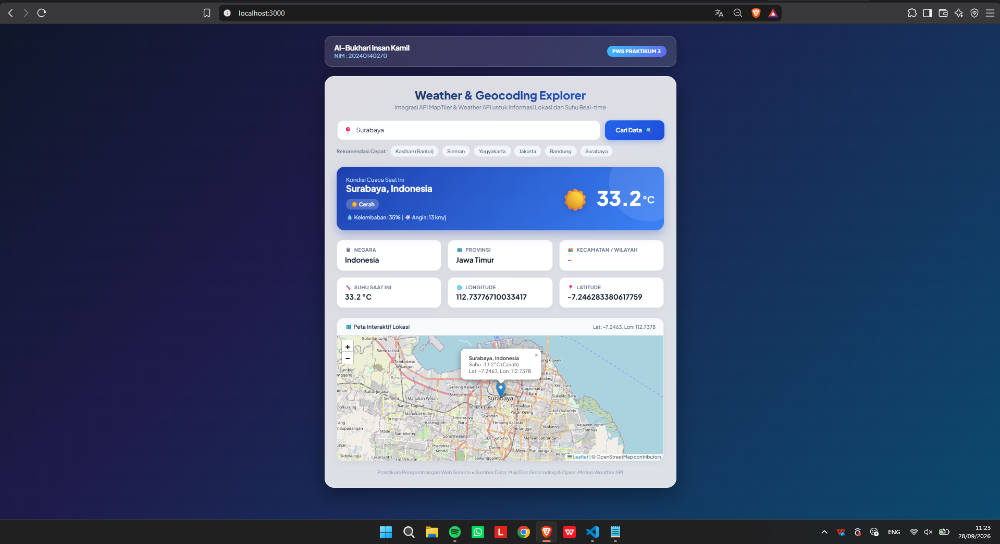

# 270_WeatherApi - Praktikum Pengembangan Web Service
**Praktikum 3: Integrasi API MapTiler & Weather API**

### Identitas Mahasiswa
- **Nama:** Al-Bukhari Insan Kamil
- **NIM:** 20240140270
- **Mata Kuliah:** Pengembangan Web Service

---

## Deskripsi Proyek
Aplikasi web berbasis Node.js & Express untuk mengambil dan menampilkan data geocoding (negara, provinsi, kecamatan, koordinat) menggunakan API MapTiler serta data cuaca/suhu secara real-time.

## Fitur
- Input pencarian lokasi dinamis
- Informasi wilayah: Negara, Provinsi, Kecamatan / Kabupaten
- Informasi cuaca: Suhu (°C), kondisi cuaca, kelembaban, kecepatan angin
- Koordinat geografis: Longitude & Latitude
- Peta interaktif menggunakan Leaflet.js

---

## Bukti Hasil GET Data (Screenshot)
Berikut adalah bukti pengujian pengambilan data melalui API:





---

## Cara Menjalankan Proyek
1. Clone repositori:
   ```bash
   git clone https://github.com/albukhari21/270_WeatherApi.git
   cd 270_WeatherApi
   ```
2. Install dependencies:
   ```bash
   npm install
   ```
3. Jalankan server:
   ```bash
   npm start
   ```
4. Buka di browser:
   ```text
   http://localhost:3000
   ```
